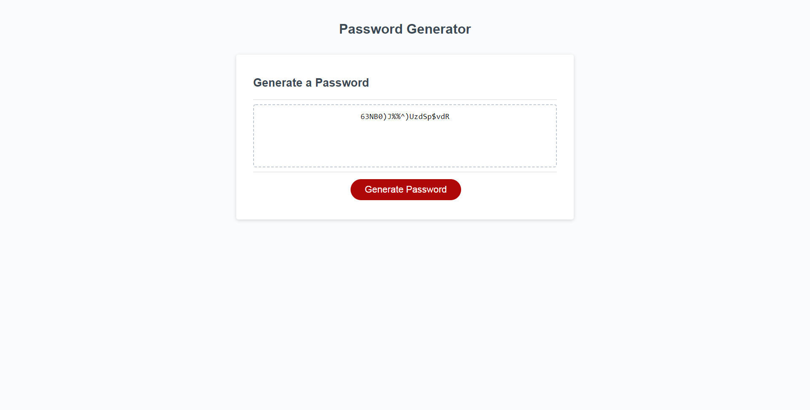

# Password Generator Starter Code

## Service
Create a generated secure password with multiple variables.

## Instructions
In order to generate a secure password, please do the following:
1. Click on the red "generate Password" button.
2.Select a value of 8 through 128 to determine password length when prompted by pop-up window. 
3. Choose specifications desired for password by selecting "Ok" or "Cancel" (at the minimum, one specification must be made). 
* Options are as follows: (Lowercase characters, uppercase characters, numerical characters and special characters).

## Deployed Production
[Password Generator](https://elysiayn.github.io/password-generator/)

## Changes made to JS file include:
* Created JS functions to compile selections made into a random variable generator. 
* Created JS functions to specify variable selections. 

### Contirbutions
Starter code provided and alterations to JS file made by Wendy Lemus.
